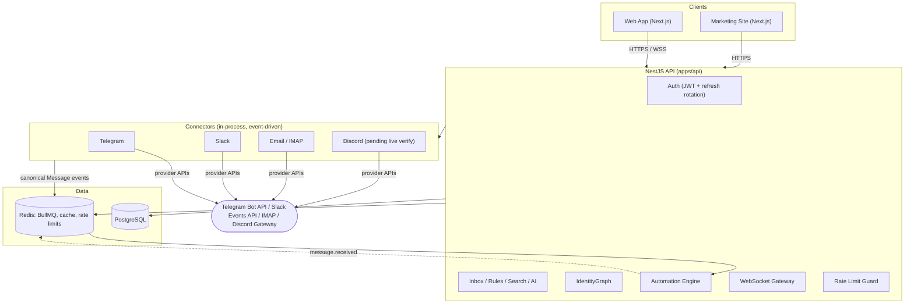

# Smart Message Center

**A unified, multi-tenant inbox that pulls Telegram, Slack, and Email into one place, then automates what happens next.**

Real connectors, a real identity-resolution engine, a real automation engine, and real production hardening (rate limiting, cursor pagination, optimistic concurrency) - not a demo shell. Every claim below is backed by a live, scripted verification run against either local dev or the production deployment; see [docs/STATUS.md](docs/STATUS.md) for the full, dated evidence trail behind each one.

[](https://smcweb-production-48c3.up.railway.app)
[](LICENSE)
[](package.json)
[](tsconfig.json)

## Live

| | |
| --- | --- |
| **App** | [smcweb-production-48c3.up.railway.app](https://smcweb-production-48c3.up.railway.app) |
| **Marketing site** | [smcmarketing-site-production.up.railway.app](https://smcmarketing-site-production.up.railway.app) |
| **API** | [smcapi-production-bc04.up.railway.app](https://smcapi-production-bc04.up.railway.app) - try `GET /health` |

Deployed on Railway: NestJS API, Next.js web app, a separately-isolated Next.js marketing site, managed PostgreSQL, and managed Redis, all running as independent services against one production database.

## What It Actually Does

- **One inbox for three real, live-verified connectors** - Telegram (Bot API), Slack (OAuth + Events API), and Email (IMAP receive; SMTP send is code-complete but currently blocked by Railway's platform-level outbound port restriction, not a code gap). A fourth, Discord (Gateway streaming), is code-complete and certified but not yet verified against a live server.
- **IdentityGraph** - resolves "the same human" across providers (a Telegram handle, a Slack user, an email address) into one Contact, with fuzzy-match suggestions that always require human confirmation before a merge - never a silent auto-merge.
- **A real automation engine** - trigger/condition/action rules (`message.received`, keyword/VIP conditions, tag/notify/webhook actions, a relative-time `no_reply_after` trigger backed by a durable BullMQ-scheduled job, not just an in-memory timer), with per-rule execution logs and a dry-run tester.
- **Priority-scored notifications** - VIP senders and urgency keywords override configurable silent hours; a trustworthy "Needs You" count, not a raw unread badge.
- **Full-text and contact search**, a heuristic AI layer (summaries, suggested replies, rewrite, draft rule suggestions - provider-agnostic by design, swappable for a real LLM without touching call sites), and an installable PWA (offline shell, background sync, Web Push).

## Engineering Highlights

The parts most worth a second look in code review:

- **Real Postgres keyset (cursor) pagination everywhere** - no `OFFSET`, on all 11 list endpoints, including a full-text-search ranked CTE and null-aware keyset logic for a nullable sort column. See [docs/API.md](docs/API.md) Section 4.
- **HTTP-native optimistic concurrency** - `ETag` / `If-Match` / `If-None-Match`, atomic against the version a client actually declares (not one the server just re-fetched), `428`/`412`/`304` all real. Found and fixed a genuine latent bug via this work: a prior version of the rules endpoint compared against its own just-fetched state instead of the client's, so a real edit-conflict could never have fired. See [docs/API.md](docs/API.md) Section 8.
- **Redis-backed rate limiting**, tiered by plan, verified race-free under real concurrent load (an 80-concurrent-request test against a 60/min limit landed exactly 60/60 allowed).
- **Two-level multi-tenancy** (Organization → Workspace) with role-based authorization checked on every mutating request, soft deletes throughout, and an append-only audit log.
- **Event-driven core** - every inbound message is a canonical domain event on a Redis/BullMQ bus; connectors are the only code that knows a specific provider's wire format.
- **A documented, evidence-based build discipline** - every phase in [docs/ROADMAP.md](docs/ROADMAP.md) ships with a scripted regression check (`scripts/verify-*`) run against a real running server, not mocked. Disclosed simplifications are written down where they exist, not hidden.

## Tech Stack

| Layer | Choice |
| --- | --- |
| Language | TypeScript, strict, across the whole stack |
| API | NestJS 10 (REST, RFC 7807 problem+json errors) |
| Web | Next.js 14 (App Router), installable PWA |
| Database | PostgreSQL + Prisma 6 (real migrations, not `db push`, since [ADR-0023](docs/adr/0023-prisma-migrate-replaces-db-push.md)) |
| Queue / cache / realtime | Redis + BullMQ, WebSocket push |
| Monorepo | pnpm workspaces + Turborepo ([ADR-0011](docs/adr/0011-monorepo-layout.md)) |
| Auth | Custom JWT + refresh-token rotation with reuse detection ([ADR-0014](docs/adr/0014-custom-jwt-session-auth.md)) |
| Deployment | Railway (API, web, marketing site, managed Postgres, managed Redis) |

## Connectors

| Provider | Status | Notes |
| --- | --- | --- |
| Telegram | ✅ Live-verified | Bot API, real bot, real chat round-trip confirmed in production |
| Slack | ✅ Live-verified | OAuth install + Events API webhook, real workspace round-trip confirmed in production |
| Email | ✅ Receive live-verified | IMAP receive confirmed against a real mailbox; SMTP send is code-complete, blocked by Railway's outbound port policy (platform limitation, not a code gap) |
| Discord | ⏳ Code-complete, certified | Gateway streaming ingestion built and passes its certification suite; live verification pending access to the Discord Developer Portal |

## Production Readiness (Phase 20)

| | Status |
| --- | --- |
| 20.1 Real rate limiting | ✅ Live in production |
| 20.2 Real cursor pagination | ✅ Live in production |
| 20.3 `?sortBy=`/`?order=` | ✅ Live in production |
| 20.4 `ETag`/`If-Match` optimistic concurrency | ✅ Live in production |
| 20.5 Observability foundation | ✅ Verified locally - trace IDs, structured logging, Prometheus `/metrics` (OTel tracing and a deployed Grafana/Loki stack are documented as a future step, not built) |

## Architecture



## Running It Locally

```bash
pnpm install
docker compose up -d   # Postgres, Redis, mailhog
pnpm --filter @smc/database db:generate
pnpm --filter @smc/database db:migrate:deploy
pnpm dev                # apps/web on :3000, apps/api on :4000
```

Then `GET http://localhost:4000/health`, or `POST http://localhost:4000/v1/auth/register`. See [docs/STATUS.md](docs/STATUS.md)'s "What Actually Runs Right Now" section for the full walkthrough, including a Windows/WSL note that will save real time if hit cold.

## Repository Layout

Finalized via [ADR-0011](docs/adr/0011-monorepo-layout.md) - a pnpm workspace + Turborepo monorepo:

```
docs/                  product and technical design documents, ADRs, phase reviews
apps/
  web/                 Next.js inbox app
  api/                 NestJS backend - auth, inbox, rules, connectors, identity, AI, realtime
  marketing-site/      isolated Next.js marketing site (ADR-0020)
packages/
  connector-sdk/       Telegram/Slack/Discord/Email connector implementations
  automation-engine/   trigger/condition/action evaluation
  database/            Prisma schema, client, soft-delete extension
  identity/            IdentityGraph resolver (exact + fuzzy match)
  event-model/         canonical event envelope + event types
  ai/                  provider-agnostic AI abstraction
  shared/              canonical domain types
  ui/                  minimal component primitives
infrastructure/        Docker, Docker Compose
scripts/                @smc/scripts - regression checks (verify-phase*.mjs) run against a live server
```

## Documentation

- [docs/STATUS.md](docs/STATUS.md) - current state of the project, dated evidence for every claim above. Read this first.
- [docs/ROADMAP.md](docs/ROADMAP.md) - the full phase plan and the working rules that govern how this project is built.
- [CHANGELOG.md](CHANGELOG.md) - what shipped, in order.
- [docs/PRODUCT.md](docs/PRODUCT.md) - vision, personas, problems/solutions, competitors, pricing.
- [docs/ARCHITECTURE.md](docs/ARCHITECTURE.md) - full system architecture, including the target-state design this implementation is converging on.
- [docs/DATABASE.md](docs/DATABASE.md) - full PostgreSQL schema design.
- [docs/API.md](docs/API.md) - the API contract.
- [docs/SECURITY.md](docs/SECURITY.md) - threat model, credential handling, GDPR posture.
- [docs/DECISIONS.md](docs/DECISIONS.md) - index of every Architecture Decision Record ([docs/adr/](docs/adr/)).
- [docs/reviews/](docs/reviews/) - the phase review filed at the end of every completed phase.

## Working Rules

Documented in full in [docs/ROADMAP.md](docs/ROADMAP.md). The short version: document before coding; every phase ends with working software, a phase review, and a git tag; nothing ships that isn't traceable to [docs/PRODUCT.md](docs/PRODUCT.md); every hard-to-reverse technical decision gets an ADR; disclosed simplifications are written down where they exist, never hidden.

## License

This repository is public for transparency and portfolio purposes only. It is **not** open source - see [LICENSE](LICENSE). No permission is granted to use, copy, or distribute its contents.
